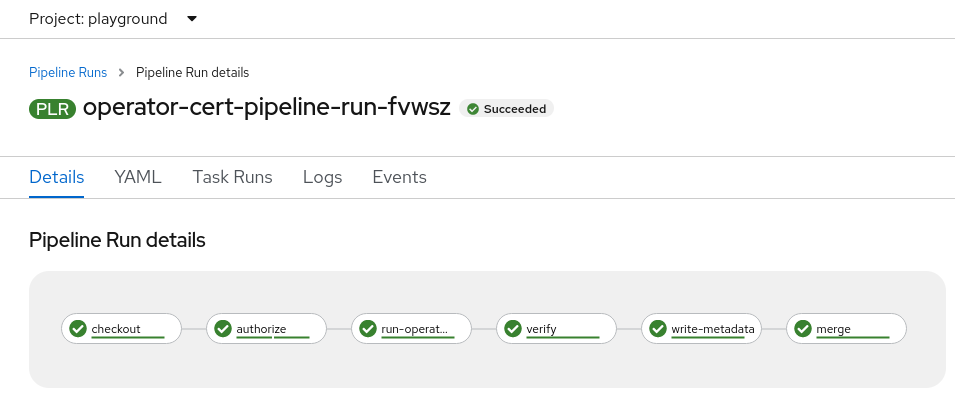

# operator-pipelines-poc
Proof of Concept for an Operator Certification Pipeline using OpenShift Pipelines.

This proof of concept was put together using Red Hat CodeReady Containers (CRC).
Alternatively, it should be possible to run these pipelines on any OpenShift
cluster of your choosing with minor adjustments.

Additionally, for demonstration purposes, this uses the already established
structure of the Community Operator Pipeline. It should ultimately be triggered
by pull requests made to certified and/or Red Hat Marketplace submission repos.

## Prerequisites

1. Install [CodeReady Containers](https://code-ready.github.io/crc/#installation_gsg)
2. Install [OpenShift Pipelines](https://docs.openshift.com/container-platform/4.7/cicd/pipelines/installing-pipelines.html)
3. Install the [tkn](https://console-openshift-console.apps-crc.testing/command-line-tools) CLI for your cluster version

## Initial Setup
The following steps assume you have access to a local CRC test cluster and have
logged in via the `oc` CLI (as developer).

1. Create a test project in your cluster

```bash
oc new-project playground
```

2. Clone this repository

```bash
git clone https://github.com/amisstea/operator-pipelines-poc.git
```

3. Apply the OpenShift resources

```bash
oc apply -R -f operator-pipelines-poc/config
```

4. Fork the [community-operators](https://github.com/operator-framework/community-operators)
   repo. Modify one of the operators utilizing the bundle format
   ([example](https://github.com/amisstea/community-operators/commit/88c9c0e4e843e4f5fb34033abb924606017064aa))
   and push your local changes so they are accessible for testing.

## Running the Base Test Pipeline

Assuming the working directory is the root of this repo, the base test pipeline
(the one a partner may run) can be manually triggered with a Git source
location.

```bash
tkn pipeline start operator-test-pipeline \
  --param git_repo_url=[GIT_REPO] \
  --param git_revision=[BRANCH,COMMIT,TAG] \
  --param bundle_path=[RELATIVE_PATH_WITHIN_GIT_REPO] \
  --workspace name=pipeline,volumeClaimTemplateFile=test/workspace-template.yml \
  --showlog
```

Ex:

```bash
tkn pipeline start operator-test-pipeline \
  --param git_repo_url=https://github.com/amisstea/community-operators.git \
  --param git_revision=test-branch \
  --param bundle_path=community-operators/kogito-operator/1.6.0 \
  --workspace name=pipeline,volumeClaimTemplateFile=test/workspace-template.yml \
  --showlog
```

That's it! A `PipelineRun` should now be running.

## Running the Red Hat Certification Pipeline

1. [Optional] Expose your local CRC cluster to the internet, if necessary.
   Tools such as [ngrok](https://dashboard.ngrok.com/get-started/setup) are
   handy for this. This is only required if your cluster cannot be reached
   from beyond your network. For example:

```bash
OCP_ROUTE=$(oc get route operator-cert-ci -o jsonpath='{.spec.host}')
ngrok http --host-header=rewrite $OCP_ROUTE:80
```

2. Setup a GitHub webhook on your fork of `community-operators`. Point this
   hook at your publicly accessible tunnel or OpenShift route. The only
   event type that is supported for now is `Pull requests`.

3. Submit a pull request from your branch to the `master` branch of your
   forked `community-operators` repo. This should trigger the creation of a
   `PipelineRun`.

## Limitations

### Pipelines in Pipelines

Tekton does not yet support
[pipelines-in-pipelines](https://github.com/tektoncd/community/blob/main/teps/0056-pipelines-in-pipelines.md).

#### Workaround

The `tkn` `ClusterTask` can be used to start pipelines and monitor their logs.
An example of this can be found in the `run-operator-test-pipeline` pipeline
task.

### Running Tasks After Skipped Tasks
Running a task after a conditional task
(index generation/building/testing) is [not as simple](https://github.com/tektoncd/community/blob/main/teps/0059-skipping-strategies.md)
as one might expect. [Split-joining](https://github.com/tektoncd/pipeline/issues/3929)
conditional branches, a common CI/CD workflow, is not available in Tekton's beta state.
The `Pipeline` schema has a `finally` section for tasks to always run at the end
but that won't be ideal in a lot of circumstances. On top of that, tasks under
`finally` are always run in parallel.

#### Workaround

Embedding pipelines in pipelines can likely solve most problems at the expense
of creating additional `PipelineRuns` and the confusion that may cause. See the
workaround.
